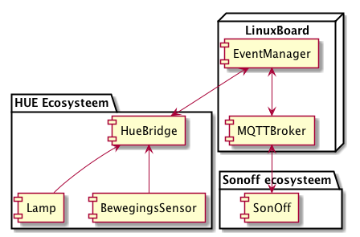

# EVENT MANAGER

## General idea 

This project was born out of interest in controlling the Philips HUE 
lighting system. Later, the idea evolved to make a more generic and
configurable system. This led to developing the initial "Event Manager".

With this software, you can integrate MQTT devices, such as the Sonoff 
Wifi switch (custom hardware nessesary!) and the entire ecosystem of
Philips HUE devices.

The system allows you to connect **devices**, build **rules** based on the 
**events** that occur and execute custom **actions**.

Basically an implementation of the "if this, then that" principle, 
but hosted in your own home.

## Architecture

The main component of this project runs on a linux board. I use the 
ever trustworthy BeagleBoneBlack. You could use Raspberry Pi or any
other linux board for that matter.

The main architecture:



The Event Manager is controlled using a configuration file. This 
configuration file activates "bridges" (such as MQTT devices or HUE 
hubs) and integrates the device into the event manager.

The bridges handle the device specifics of each device, enabling 
the event manager to receive and send events from any bridge to 
any bridge (or even the same bridge).

The event manager maintains a list of "rules". Each event the event 
manager receives, is checked against the *rules*. When such a rule
matches, the *actions* of that rule are executed.

An *action* might be to trigger something on another bridge, or maybe
send out an email or...

## An example

We want to create the scenario that if you press on a hue light button,
a SonOff switch will react to that event.

All events are expressed in URL's. An URL indicates what type of bridge,
what bridge and which device under that bridge the event is related to.

```
hue://hue1/sensors/10/button#4000
```

Might be an example of a hue 4-button button on bridge `hue`, sensor 
`10`. The last part, #4000 tells us button 4 has been pressed. This is 
where we want to match a rule to. 

The rule we could configure would be:
 
```json
    {
      "type": "regex",
      "regex": "^hue://hue1/sensors/10/button#4000$",
      "actions": [
        {
          "type": "wait",
          "seconds": 5
        },
        {
          "type": "trigger",
          "trigger": "bridge://mqtt1/sonoff-mylight/cmnd/Power1"
        }
      ]
    }
```

The rule here is a rule of type regex. It needs a regular expression
on which to match the event. The button press event matches this rule,
so the actions in this rule are executed one by one.

The first action will wait 5 seconds, the second will trigger an event 
on bridge "mqtt1". This will cause the topic "sonoff-mylight/cmnd/Power1" 
to be published (empty message). 

It will cause the SonOff switch (you will need tasmota firmware for 
this!) to toggle it's power.

### Installation

### Configuration

The configuration file is structured as follows:

```json
{
  "bridges": [
    ...
  ],
  "rules": [
    ...
  ]
}
```

All the bridges are mentioned in an array under `"bridges"`, all the rules 
are present under `"rules"`. 

#### Bridges

##### HUE

This configures the Philips HUE bridge. This bridge uses a polling mechanism
to retrieve all the device statuses. Every status change will be converted
into an event URL and published to the event manager.

**Make sure that you do not saturate the HUE bridge by setting the 
`pollInterval` too low.** If you keep it below 10 polls per second you 
should be fine. 

Configuration example:

```json
    {
      "name": "hue1",
      "description": "HUE bridge 1",
      "type": "hue",
      "apiKey": "ktA1-FuirVj0yz6MXmpdx8QXgFIL44lAcC0ikeBd",
      "pollInterval": 200
    }
```

Key          | Explanation
------------ | -------------
name         | The name this bridge will be known as. It is used in the addressing scheme triggers use. E.g: bridge://NAME/rest/of/uri. 
description  | The description of this device. Only for documenting the bridge.
type         | "hue"
apiKey       | The API key of the Hue bridge. See the philips HUE documentation on how to setup an API key.
pollInterval | Poll interval in milliseconds. Keep this above 100.

##### MQTT


#### Rules

#### Actions

## Implementing new hardware interfaces

## Compatibility

* Philips HUE
* Sonoff (all models, modified firmware, e.g. Tasmota)
* (coming) Z wave

## About the author
